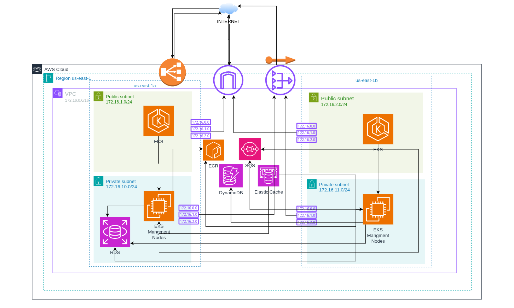
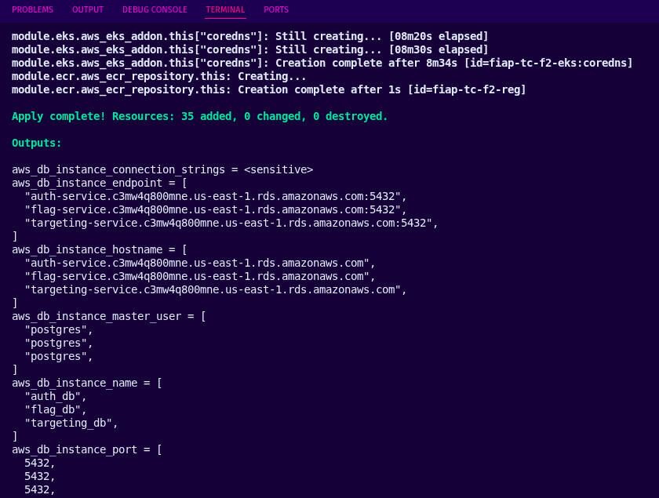

# 🚀 Tech Challenge Fase 3 - IaC Terraform

[](https://www.terraform.io/)
[](https://aws.amazon.com/)

> ⚠️ **PROJETO DIDÁTICO** - Este projeto foi desenvolvido como parte do Tech Challenge Fase 3 da Pós-Tech FIAP em Arquitetura Cloud e DevOps.

## 📋 Sobre o Projeto
Este projeto representa o escopo de infraestrutura como código da Fase 3 do Tech Challenge, implementando recursos AWS com Terraform e execução automatizada por esteira GitHub Actions.

## Escopo

Este repositório contém a definição da infraestrutura AWS utilizando Terraform. O código está organizado em módulos para provisionar recursos de rede, computação, banco de dados, cache, mensageria, registry de imagens e banco NoSQL.

Não fazem parte do escopo deste README:

- Código de aplicação.
- Build de imagens Docker.
- Deploy de workloads Kubernetes.
- Manifestos Kubernetes.
- Pipelines CI/CD de aplicação.

### 📊 Diagrama da Arquitetura




## 🛠️ Tecnologias Utilizadas

- **Orquestração:** Kubernetes (AWS EKS)
- **Containerização:** Docker com multi-stage builds
- **Banco de Dados:** PostgreSQL (AWS RDS), Redis (AWS ElastiCache), DynamoDB
- **Mensageria:** AWS SQS
- **Load Balancer:** Nginx Ingress Controller gateway fabric


## Recursos Provisionados

| Módulo | Serviço AWS | Responsabilidade |
|--------|-------------|------------------|
| `vpc` | VPC | Rede, subnets públicas, subnets privadas, rotas, Internet Gateway, NAT Gateway e Elastic IP |
| `eks` | EKS | Cluster Kubernetes gerenciado |
| `ecr` | ECR | Repositório para imagens Docker |
| `rds` | RDS PostgreSQL | Banco de dados relacional |
| `redis` | ElastiCache Redis | Cache gerenciado |
| `sqs` | SQS | Fila de mensageria |
| `dynamodb` | DynamoDB | Tabela NoSQL |

## 📁 Estrutura do Projeto

```text
├── backends
│   ├── dev.tfbackend
│   └── prd.tfbackend
├── bootstrap-backend
│   ├── locals.tf
│   ├── main.tf
│   ├── output.tf
│   ├── provider.tf
│   ├── README.md
│   ├── required.tf
│   ├── terraform.tfstate
│   ├── terraform.tfstate.backup
│   ├── terraform.tfvars
│   └── variable.tf
├── iac.tftest.hcl
├── main.tf
├── modules
│   ├── dynamodb
│   │   ├── locals.tf
│   │   ├── main.tf
│   │   ├── output.tf
│   │   ├── README.md
│   │   ├── variable.tf
│   │   └── versions.tf
│   ├── ecr
│   │   ├── locals.tf
│   │   ├── main.tf
│   │   ├── output.tf
│   │   ├── README.md
│   │   ├── variable.tf
│   │   └── versions.tf
│   ├── eks
│   │   ├── data.tf
│   │   ├── locals.tf
│   │   ├── main.tf
│   │   ├── output.tf
│   │   ├── README.md
│   │   ├── variable.tf
│   │   └── versions.tf
│   ├── rds
│   │   ├── data.tf
│   │   ├── locals.tf
│   │   ├── main.tf
│   │   ├── output.tf
│   │   ├── README.md
│   │   ├── variable.tf
│   │   └── versions.tf
│   ├── redis
│   │   ├── locals.tf
│   │   ├── main.tf
│   │   ├── output.tf
│   │   ├── variable.tf
│   │   └── versions.tf
│   ├── sqs
│   │   ├── locals.tf
│   │   ├── main.tf
│   │   ├── output.tf
│   │   ├── README.md
│   │   ├── variable.tf
│   │   └── versions.tf
│   └── vpc
│       ├── eip.tf
│       ├── igw.tf
│       ├── natgateway.tf
│       ├── output.tf
│       ├── README.md
│       ├── rt.tf
│       ├── subnet.tf
│       ├── variable.tf
│       ├── versions.tf
│       └── vpc.tf
├── output.tf
├── provider.tf
├── README.md
├── required.tf
├── terraform.dev.tfvars
├── terraform.prd.tfvars
├── terraform.tfstate
├── terraform.tfstate.backup
└── variable.tf
```

## Requisitos

- Terraform instalado.
- AWS CLI instalado e configurado.
- Credenciais AWS com permissão para criar os recursos definidos nos módulos.
- Provider AWS `6.44.0`.

Configure as credenciais AWS antes da execução:

```bash
aws configure
```

Ou utilize variáveis de ambiente:

```bash
export AWS_ACCESS_KEY_ID="sua-access-key"
export AWS_SECRET_ACCESS_KEY="sua-secret-key"
export AWS_SESSION_TOKEN="seu-session-token"
export AWS_DEFAULT_REGION="us-east-1"
```

> A variável `AWS_SESSION_TOKEN` é necessária quando forem utilizadas credenciais temporárias da AWS, como sessões STS, SSO ou credenciais geradas por laboratório.

## Variáveis

As variáveis principais estão definidas em `iac/terraform/variable.tf`.

| Variável | Tipo | Descrição |
|----------|------|-----------|
| `aws_vpc` | `object` | Configuração da VPC, subnets públicas, subnets privadas e tabelas de rota |
| `rds` | `object` | Configuração das instâncias RDS PostgreSQL |
| `aws_sqs_queue_name` | `string` | Nome da fila SQS |
| `aws_dynamodb_table_name` | `string` | Nome da tabela DynamoDB |
| `aws_eks_cluster_version` | `string` | Versão do cluster EKS |

## Exemplo de `terraform.tfvars`

O arquivo `terraform.tfvars` deve ser criado localmente dentro de `iac/terraform`. Ele não deve ser versionado, pois pode conter dados sensíveis.

```hcl
aws_eks_cluster_version = "1.31"

aws_sqs_queue_name = "togglemaster-analytics-events"

aws_dynamodb_table_name = "togglemaster-analytics"

aws_vpc = {
  name                     = "togglemaster-vpc"
  cidr_block               = "10.0.0.0/16"
  internet_gateway_name    = "togglemaster-igw"
  nat_gateway_name         = "togglemaster-nat"
  public_route_table_name  = "togglemaster-public-rt"
  private_route_table_name = "togglemaster-private-rt"

  public_subnets = [
    {
      name                    = "togglemaster-public-a"
      cidr_block              = "10.0.1.0/24"
      availability_zone       = "us-east-1a"
      map_public_ip_on_launch = true
    },
    {
      name                    = "togglemaster-public-b"
      cidr_block              = "10.0.2.0/24"
      availability_zone       = "us-east-1b"
      map_public_ip_on_launch = true
    }
  ]

  private_subnets = [
    {
      name                    = "togglemaster-private-a"
      cidr_block              = "10.0.11.0/24"
      availability_zone       = "us-east-1a"
      map_public_ip_on_launch = false
    },
    {
      name                    = "togglemaster-private-b"
      cidr_block              = "10.0.12.0/24"
      availability_zone       = "us-east-1b"
      map_public_ip_on_launch = false
    }
  ]
}

rds = {
  rds_properties = [
    {
      name    = "togglemaster-db"
      db_name = "togglemaster"
      db_user = "postgres"
      db_pass = "altere-esta-senha"
    }
  ]
}
```

## Modelo de Uso manual

Acesse o diretório Terraform:

```bash
cd iac/terraform
```

Inicialize o Terraform:

```bash
terraform init
```

Valide a configuração:

```bash
terraform validate
```

Formate os arquivos:

```bash
terraform fmt -recursive
```

Gere o plano de execução:

```bash
terraform plan -out=tfplan
```

Aplique a infraestrutura:

```bash
terraform apply tfplan
```

Consulte os outputs:

```bash
terraform output
```

Destrua a infraestrutura quando ela não for mais necessária:

```bash
terraform destroy
```

## Execução via GitHub Actions

A esteira GitHub Actions deve executar os comandos Terraform a partir do diretório `iac/terraform`, mantendo o processo automatizado dentro do escopo de IaC.

### Fluxo recomendado

| Evento | Ação | Objetivo |
|--------|------|----------|
| Pull request | `terraform fmt -check`, `terraform validate`, `tflint`, `checkov` e `terraform plan` | Validar qualidade e segurança antes do merge |
| Push na branch principal | `terraform init`, `terraform plan` e `terraform apply` | Aplicar a infraestrutura aprovada |
| Execução manual | `terraform destroy` | Remover a infraestrutura quando necessário |

### Secrets e variáveis

Configure os seguintes secrets no repositório GitHub em `Settings > Secrets and variables > Actions`:

| Nome | Descrição |
|------|-----------|
| `AWS_ACCESS_KEY_ID` | Access key da conta AWS |
| `AWS_SECRET_ACCESS_KEY` | Secret key da conta AWS |
| `AWS_SESSION_TOKEN` | Token de sessão para credenciais temporárias da AWS |
| `AWS_REGION` | Região AWS utilizada pela infraestrutura |
| `TF_BACKEND_BUCKET` | Bucket S3 usado para armazenar o state remoto |
| `TF_BACKEND_KEY` | Caminho do arquivo de state dentro do bucket S3 |
| `TF_BACKEND_REGION` | Região AWS do bucket S3 do backend |
| `TERRAFORM_TFVARS` | Conteúdo completo do arquivo `terraform.tfvars` usado pela esteira |

Os valores não sensíveis podem ser configurados como variables do GitHub Actions ou em arquivos versionados de exemplo, como `terraform.tfvars.example`.

O backend remoto usa S3 com lock nativo por arquivo `.tflock`, habilitado por `use_lockfile=true`. Não é necessário criar tabela DynamoDB para lock. Garanta que o bucket S3 tenha versionamento habilitado e que a credencial da esteira tenha permissão de `s3:ListBucket`, `s3:GetObject`, `s3:PutObject` e `s3:DeleteObject` para o arquivo de lock.

### Exemplo de workflow

Crie o arquivo `.github/workflows/terraform.yml` com os detalhes resumido abaixo.:

Workflow manual (`workflow_dispatch`) para Terraform com `action` (`plan|apply|destroy`).

Ele:
1. Configura AWS, Terraform e TFLint.
2. Detecta a branch e escolhe ambiente:
- `dev` -> `terraform.dev.tfvars`
- `main` -> `terraform.prd.tfvars`
3. Roda validações (`fmt`, `init` com backend por ambiente, `validate`, `tflint`, `terraform test`) e `Checkov`.
4. Executa:
- `plan` (gera `tfplan`)
- `apply` só manual
- `destroy` só manual.


```yaml
name: Terraform IaC

on:
  workflow_dispatch:
    inputs:
      action:
        description: "Ação Terraform"
        required: true
        default: "plan"
        type: choice
        options:
          - plan
          - apply
          - destroy

jobs:
  terraform:
    name: Terraform
    runs-on: ubuntu-latest
    defaults:
      run:
        working-directory: iac/terraform

    env:
      # AWS_ACCESS_KEY_ID: ${{ secrets.AWS_ACCESS_KEY_ID }}
      # AWS_SECRET_ACCESS_KEY: ${{ secrets.AWS_SECRET_ACCESS_KEY }}
      # AWS_SESSION_TOKEN: ${{ secrets.AWS_SESSION_TOKEN }}
      # AWS_REGION: ${{ secrets.AWS_REGION }}
      # AWS_DEFAULT_REGION: ${{ secrets.AWS_REGION }}
      TF_IN_AUTOMATION: true
      TF_INPUT: false

    steps:
      - name: Checkout
        uses: actions/checkout@v4
     
      - name: Configura credenciais AWS
        uses: aws-actions/configure-aws-credentials@v4
        with:
          aws-access-key-id: ${{ secrets.AWS_ACCESS_KEY_ID }}
          aws-secret-access-key: ${{ secrets.AWS_SECRET_ACCESS_KEY }}
          aws-session-token: ${{ secrets.AWS_SESSION_TOKEN }}
          aws-region: ${{ secrets.AWS_REGION }}

      - name: Setup Terraform
        uses: hashicorp/setup-terraform@v3

      - name: Configura TFLint
        uses: terraform-linters/setup-tflint@v4

      - name: Define arquivo tfvars por branch
        run: |
          # pull_request usa GITHUB_BASE_REF (branch de destino do PR)
          # push e workflow_dispatch usam GITHUB_REF_NAME (branch atual)
          if [ "${GITHUB_EVENT_NAME}" = "pull_request" ]; then
            BRANCH="${GITHUB_BASE_REF}"
          else
            BRANCH="${GITHUB_REF_NAME}"
          fi

          echo "Branch detectada: ${BRANCH}"

          case "${BRANCH}" in
            dev)
              ENV="dev"
              ;;
            main)
              ENV="prd"
              ;;
            *)
              echo "❌ Branch não suportada para deploy: ${BRANCH}"
              exit 1
              ;;
          esac

          echo "TF_VARS_FILE=terraform.${ENV}.tfvars" >> "$GITHUB_ENV"
          echo "DEPLOY_ENV=${ENV}" >> "$GITHUB_ENV"

      - name: Mostra arquivo tfvars selecionado
        run: |
          echo "Ambiente: ${DEPLOY_ENV}"
          echo "Arquivo: ${TF_VARS_FILE}"

      - name: Lint Terraform
        run: |
          terraform fmt -check -recursive
          terraform init -upgrade -backend-config="backends/${DEPLOY_ENV}.tfbackend"
          terraform validate
          tflint --init
          tflint --recursive

      - name: Testes unitários
        run: terraform test

      - name: Gera relatório Checkov
        id: checkov
        uses: bridgecrewio/checkov-action@master
        with:
          directory: iac/terraform
          framework: terraform
          output_format: cli,sarif,json
          output_file_path: console,results.sarif,checkov-report.json
          soft_fail: true

      - name: Publica relatório Checkov em tabela
        if: always()
        run: |
          echo "## Relatório Checkov (Terraform) — Ambiente: ${DEPLOY_ENV}" >> "$GITHUB_STEP_SUMMARY"
          echo "" >> "$GITHUB_STEP_SUMMARY"

          if [ -s checkov-report.json ]; then
            FAILED=$(jq '[.results.failed_checks[]?] | length' checkov-report.json 2>/dev/null || echo "0")
            PASSED=$(jq '[.results.passed_checks[]?] | length' checkov-report.json 2>/dev/null || echo "0")

            if [ "${FAILED}" -gt "0" ]; then
              echo "⚠️ **${FAILED} finding(s) encontrado(s) — revisar antes do apply**" >> "$GITHUB_STEP_SUMMARY"
            else
              echo "✅ **Nenhum finding detectado — ${PASSED} checks passaram**" >> "$GITHUB_STEP_SUMMARY"
            fi

            echo "" >> "$GITHUB_STEP_SUMMARY"
            echo "| Status | Check ID | Severidade | Recurso | Arquivo |" >> "$GITHUB_STEP_SUMMARY"
            echo "|---|---|---|---|---|" >> "$GITHUB_STEP_SUMMARY"

            jq -r '
              (.results.failed_checks[]? | [
                "❌ FAILED",
                (.check_id // "-"),
                (.severity // "-"),
                (.resource // "-"),
                (.file_path // "-")
              ]),
              (.results.passed_checks[]? | [
                "✅ PASSED",
                (.check_id // "-"),
                (.severity // "-"),
                (.resource // "-"),
                (.file_path // "-")
              ])
              | @tsv
            ' checkov-report.json 2>/dev/null | \
            while IFS=$'\t' read -r status check_id severity resource file_path; do
              echo "| ${status} | ${check_id} | ${severity} | ${resource} | ${file_path} |" >> "$GITHUB_STEP_SUMMARY"
            done
          else
            echo "⚠️ **Checkov não gerou relatório JSON**" >> "$GITHUB_STEP_SUMMARY"
          fi

      - name: Terraform Plan
        if: >-
          github.event_name == 'pull_request' ||
          github.event_name == 'push' ||
          (github.event_name == 'workflow_dispatch' && (github.event.inputs.action == 'plan' || github.event.inputs.action == 'apply'))
        run: terraform plan -var-file="${TF_VARS_FILE}" -out=tfplan

      - name: Terraform Apply
        # Somente via workflow_dispatch — sem apply automático no push
        if: github.event.inputs.action == 'apply'
        run: terraform apply -auto-approve tfplan

      - name: Terraform Destroy
        # Somente via workflow_dispatch com branch como fonte da verdade do ambiente
        if: github.event.inputs.action == 'destroy'
        run: terraform destroy -var-file="${TF_VARS_FILE}" -auto-approve
```

### Recomendações para a esteira

- Utilizar GitHub Environments com aprovação manual para execuções de `apply` e `destroy`.
- Armazenar o state em backend remoto S3 com lock nativo por arquivo `.tflock`, antes de executar a esteira em ambiente compartilhado.
- Não salvar `terraform.tfvars`, `*.tfstate` ou planos gerados como artefatos públicos.
- Revisar o resultado do `terraform plan` em pull requests antes do merge.
- Executar `destroy` apenas por `workflow_dispatch` e com aprovação manual.

## Outputs

Os outputs principais estão definidos em `iac/terraform/output.tf`.

| Output | Descrição |
|--------|-----------|
| `vpc_id` | ID da VPC |
| `internet_gateway_id` | ID do Internet Gateway |
| `public_subnet_id` | IDs das subnets públicas |
| `private_subnet_id` | IDs das subnets privadas |
| `aws_db_instance_endpoint` | Endpoint do RDS |
| `aws_db_instance_connection_strings` | String de conexão PostgreSQL, marcada como sensível |
| `aws_eks_cluster_id` | ID do cluster EKS |
| `aws_eks_cluster_endpoint` | Endpoint do cluster EKS |
| `aws_ecr_repository_repository_url` | URL do repositório ECR |
| `aws_elasticache_cluster_cluster_address` | Endereço do cluster ElastiCache |

Para consultar outputs sensíveis:

```bash
terraform output -json
```
## Outputs do terraform apply


## Arquivos Ignorados

Os seguintes arquivos e diretórios não devem ser versionados:

```text
**/.terraform/
*.tfstate
*.tfstate.*
*.tfvars
*.tfvars.json
*.tfplan
*.plan
crash.log
override.tf
*_override.tf
```

## Boas Práticas

- Revisar sempre o resultado de `terraform plan` antes do `terraform apply`.
- Não versionar state, planos de execução ou arquivos com variáveis sensíveis.
- Utilizar backend remoto para o state em ambientes compartilhados.
- Proteger senhas e credenciais com AWS Secrets Manager, SSM Parameter Store ou ferramenta equivalente.
- Executar `terraform destroy` em ambientes temporários para evitar custos desnecessários.


## 👨‍💻 Autores

**Edson Leandro da Silva Nascimento**
- Pós-Tech FIAP - Arquitetura Cloud e DevOps
- Tech Challenge Fase 3

---

## 📄 Licença

Este projeto é apenas para fins educacionais como parte do programa de pós-graduação devops arquitetura Cloud da instituição FIAP.
